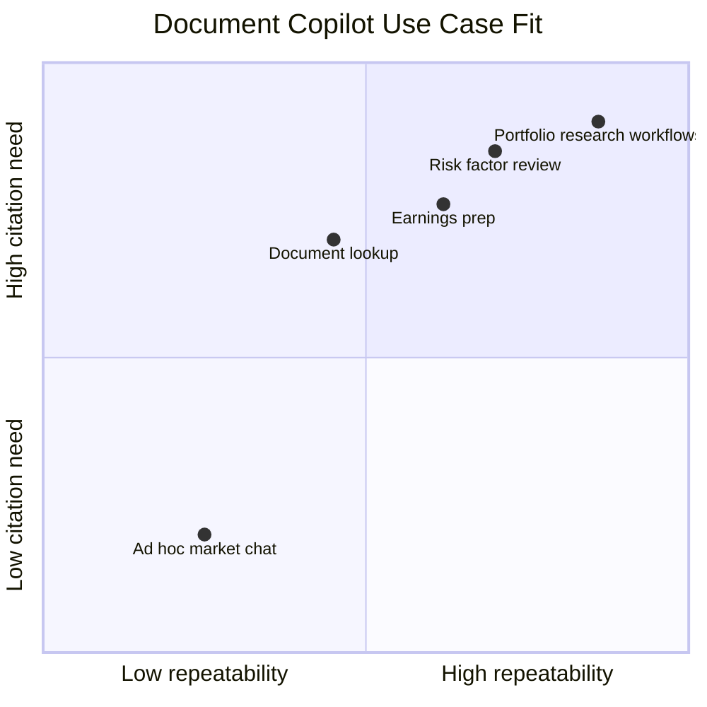
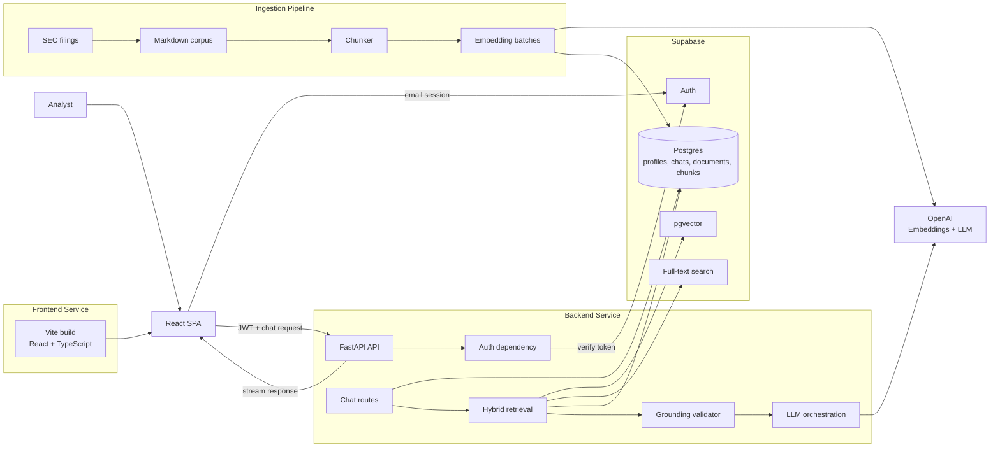
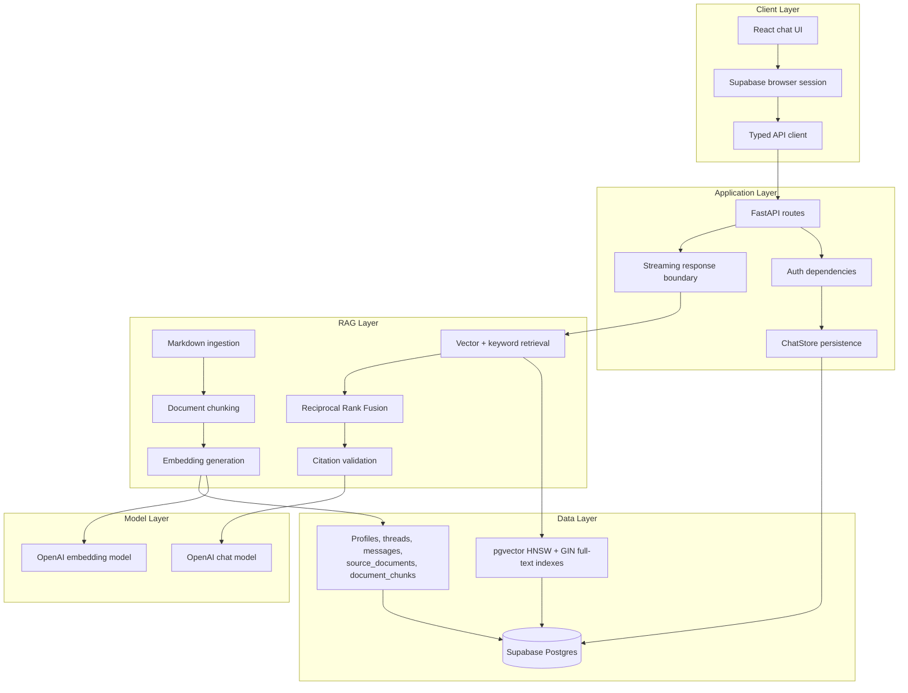

# Document Copilot

Document Copilot is a production-oriented RAG application for asking grounded questions over a curated SEC filing corpus. It combines a React chat workspace, a FastAPI backend, Supabase Auth/Postgres, OpenAI embeddings, and an ingestion pipeline that converts filings into searchable document chunks.

The product goal is simple: help analysts get answers from source documents with a clear trail back to the filings used to produce each answer.

## What It Does

- Authenticated chat workspace for document research.
- Persistent user-owned chat threads and message history.
- SEC filing ingestion from local Markdown into Supabase Postgres.
- Chunking and OpenAI embedding generation for retrieval-ready document records.
- Supabase `pgvector` and Postgres full-text architecture for hybrid retrieval.
- FastAPI service boundary for auth, persistence, retrieval, grounding, and LLM orchestration.
- React SPA frontend that talks to the backend with a Supabase bearer token.

> Current implementation note: authentication, chat shell, thread/message persistence, streaming stub responses, migrations, and ingestion are implemented. The production RAG answer path is represented in the architecture and ingestion foundation, with retrieval, grounding validation, and final assistant orchestration intended to sit behind the existing FastAPI chat boundary.

## Use Cases

| User | Use case | Example question | System output |
| --- | --- | --- | --- |
| Equity analyst | Compare company performance across filings | "How did Nvidia describe data center demand in 2023 vs 2024?" | Grounded synthesis with filing citations |
| Research associate | Find risk factors quickly | "Which companies mention supply chain risk in recent 10-Ks?" | Ranked source passages and summary |
| Portfolio team | Prepare meeting briefs | "Summarize Amazon's capital expenditure discussion over the last three years." | Concise briefing with source links |
| Compliance reviewer | Verify claims against primary documents | "Where does Apple discuss privacy regulation risk?" | Cited excerpts and document metadata |
| Engineering team | Build and evaluate RAG workflows | "Which chunks were retrieved and why?" | Inspectable retrieval, chunk, and citation records |



## Architecture

Document Copilot is split into a browser client, a stateless API service, hosted Supabase infrastructure, OpenAI model APIs, and a batch ingestion path.



### RAG And Software Layers



## Tech Stack

| Area | Technology |
| --- | --- |
| Frontend | Vite, React, TypeScript, React Router, Tailwind CSS, shadcn/ui |
| Auth | Supabase Auth |
| Backend | Python 3.12, FastAPI, Uvicorn, Pydantic v2 |
| Database | Supabase Postgres, SQLAlchemy models, Alembic migrations |
| Retrieval | `pgvector`, Postgres full-text search, Reciprocal Rank Fusion |
| AI | OpenAI SDK, OpenAI embeddings, PydanticAI target orchestration |
| Package management | `uv` for backend, `pnpm` for frontend |
| Hosting target | Railway frontend service + Railway backend service + hosted Supabase |

## Repository Layout

```text
.
|-- backend/              # FastAPI API, migrations, ingestion, tests
|-- data/                 # Local corpus tooling and gitignored downloaded payloads
|-- docs/                 # Architecture notes, setup guides, implementation plans
|-- frontend/             # Vite React SPA
|-- AGENTS.md             # Engineering rules for coding agents
`-- README.md
```

## Implementation Details

### Frontend

The frontend is a plain React SPA. It handles UI state, routing, Supabase browser auth, and authenticated requests to FastAPI.

Key modules:

- `frontend/src/lib/env.ts` validates browser-safe environment variables at startup.
- `frontend/src/lib/supabase.ts` creates the Supabase browser client.
- `frontend/src/lib/http.ts` wraps `fetch`, applies the API base URL, and attaches bearer tokens.
- `frontend/src/lib/api.ts` exposes application API calls.
- `frontend/src/pages/ChatPage.tsx` and `frontend/src/components/chat/*` render the chat workspace.

The frontend must never contain the Supabase service role key, database URL, or OpenAI API key.

### Backend

The backend is the trusted application boundary. It verifies Supabase JWTs, owns privileged credentials, persists chat records, runs ingestion, and is the intended home for retrieval, grounding, and LLM orchestration.

Key modules:

- `backend/app/main.py` creates the FastAPI app and CORS policy.
- `backend/app/config.py` validates required server environment variables.
- `backend/app/auth/dependencies.py` verifies authenticated users.
- `backend/app/api/chat.py` exposes chat thread, message, and streaming endpoints.
- `backend/app/database/chats.py` persists chat threads and messages.
- `backend/app/database/models/*` defines SQLAlchemy models used by Alembic.
- `backend/ingest/*` prepares Markdown filings, chunks text, generates embeddings, and writes source documents/chunks.

### Ingestion

The ingestion pipeline is deliberately two-stage. From the repository root, download SEC HTML and convert it into persistent normalized Markdown:

```bash
uv run data/download.py
uv run --directory backend python ../data/html_to_markdown/convert_html_to_markdown.py --overwrite
```

The backend ingestion command then reads `data/Markdown/manifest.json`. A default or explicit dry run makes no OpenAI or database writes:

```bash
cd backend
uv run document-copilot-ingest --dry-run --limit-documents 2
```

Make the first paid/database test one document and one chunk:

```bash
cd backend
uv run document-copilot-ingest --upload --limit-documents 1 --limit-chunks 1
```

For a full upload, pass `--yes` deliberately:

```bash
cd backend
uv run document-copilot-ingest --upload --yes
```

### Database

Alembic owns schema changes. Migrations live in `backend/alembic/versions`.

The database model includes:

- User profiles tied to Supabase Auth users.
- Chat threads and chat messages.
- Source documents with filing metadata.
- Document chunks with text, metadata, embedding vectors, and search fields.

Supabase/Postgres-specific features such as `vector`, HNSW indexes, GIN indexes, generated search vectors, and RLS policies belong in explicit migration operations.

## Local Development

### Prerequisites

- Python 3.12+
- `uv`
- Node.js and `pnpm`
- Supabase project
- OpenAI API key

### Backend Setup

```bash
cd backend
cp .env.example .env
uv sync
uv run alembic upgrade head
uv run uvicorn app.main:app --reload
```

Backend environment variables:

| Variable | Purpose |
| --- | --- |
| `SUPABASE_URL` | Supabase project URL |
| `SUPABASE_ANON_KEY` | Public anon key for user-scoped requests |
| `SUPABASE_SERVICE_ROLE_KEY` | Backend-only privileged Supabase key |
| `DATABASE_URL` | Direct Supabase Postgres connection string for Alembic/app DB access |
| `OPENAI_API_KEY` | OpenAI API key for embeddings and generation |
| `OPENAI_CHAT_MODEL` | PydanticAI chat model identifier, for example `openai:gpt-5-mini` |
| `OPENAI_EMBEDDING_MODEL` | Embedding model, default `text-embedding-3-small` |
| `OPENAI_EMBEDDING_DIMENSIONS` | Embedding dimension count, default `1536` |
| `ALLOWED_ORIGINS` | Comma-separated CORS origins |

### Frontend Setup

```bash
cd frontend
cp .env.example .env
pnpm install
pnpm dev
```

Frontend environment variables:

| Variable | Purpose |
| --- | --- |
| `VITE_API_BASE_URL` | FastAPI backend URL |
| `VITE_SUPABASE_URL` | Supabase project URL |
| `VITE_SUPABASE_ANON_KEY` | Browser-safe Supabase anon key |

## Quality Checks

Backend:

```bash
cd backend
uv run pytest
uv run ruff check .
```

Frontend:

```bash
cd frontend
pnpm lint
pnpm build
```

## Deployment

The intended production deployment is:

- Railway service for `backend/`
- Railway service for `frontend/`
- Hosted Supabase project for Auth and Postgres
- OpenAI API for embeddings and LLM calls

### 1. Prepare Supabase

1. Create a Supabase project.
2. Enable email auth.
3. Copy the project URL, anon key, and service role key.
4. Copy the direct Postgres connection string from project settings.
5. Run migrations from a trusted environment:

```bash
cd backend
uv run alembic upgrade head
```

### 2. Deploy Backend On Railway

Create a Railway service rooted at `backend/`.

Set these environment variables:

```text
SUPABASE_URL=
SUPABASE_ANON_KEY=
SUPABASE_SERVICE_ROLE_KEY=
DATABASE_URL=
OPENAI_API_KEY=
OPENAI_CHAT_MODEL=openai:gpt-5-mini
OPENAI_EMBEDDING_MODEL=text-embedding-3-small
OPENAI_EMBEDDING_DIMENSIONS=1536
ALLOWED_ORIGINS=https://your-frontend-domain
```

Use a production server command equivalent to:

```bash
uv run uvicorn app.main:app --host 0.0.0.0 --port $PORT
```

### 3. Deploy Frontend On Railway

Create a Railway service rooted at `frontend/`.

Set these environment variables:

```text
VITE_API_BASE_URL=https://your-backend-domain
VITE_SUPABASE_URL=
VITE_SUPABASE_ANON_KEY=
```

Build command:

```bash
pnpm install --frozen-lockfile && pnpm build
```

Serve the generated `dist/` directory with Railway's static hosting support or a small static file server configured by the deployment platform.

### 4. Ingest Documents

After the database schema is live, run ingestion from a secure environment that has backend secrets:

```bash
cd backend
uv run document-copilot-ingest --upload --yes
```

Do not run ingestion from the browser or expose ingestion credentials to the frontend.

## Security Notes

- `.env` files are intentionally ignored. Commit only `.env.example` files.
- Rotate any key that was ever committed locally or pushed to a remote.
- Keep the Supabase service role key and OpenAI API key backend-only.
- Use Supabase RLS policies for user-owned product data.
- Verify Supabase JWTs at the FastAPI boundary before any database, retrieval, or LLM work.
- Use the direct Supabase database URL for migrations, not the transaction pooler.

## Roadmap

- Implement production hybrid retrieval queries over `document_chunks`.
- Add Reciprocal Rank Fusion and source passage expansion.
- Replace the streaming stub with grounded assistant orchestration.
- Add citation validation before assistant messages are persisted.
- Add retrieval and grounding evaluation fixtures.
- Add deployment configuration files once Railway services are finalized.
